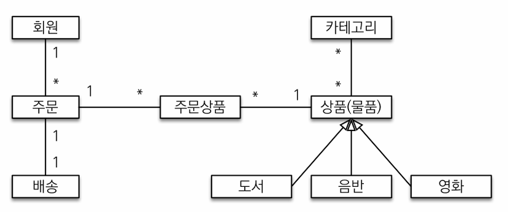
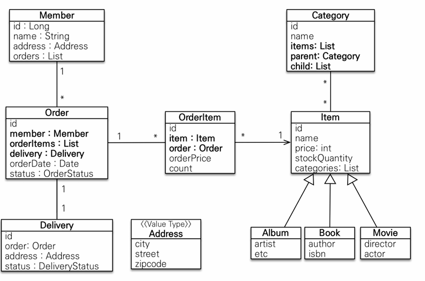
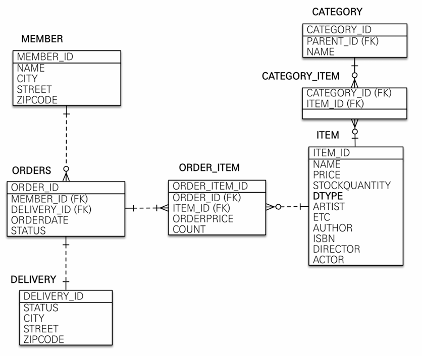
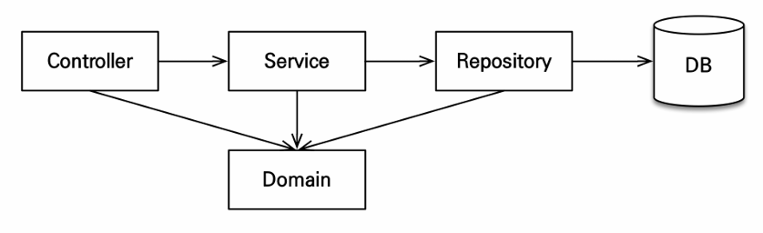

## Ch 2. 프로젝트 환경 설정
### JPA와 DB 설정, 동작확인
- application.yml에서 sql 디버그 설정할 때 jpa.properties.hibernate.show_sql이 아닌 logging.level.org.hibernate.SQL: debug를 통해 설정하자.

- 운영 환경에서 로그들은 System out(jpa.properties.hibernate.show_sql)이 아닌 로거(logging.level.org.hibernate.SQL: debug)를 통해서 찍어야 한다.  

#### 기타

#### Assertions.assertThat(findMember).isEqualTo(member)의 결과가 왜 true일까?
조회한 것과 저장한 Entity의 비교 결과가 왜 동일할까?

같은 트랜잭션 내에서 저장하고 조회하면, 같은 영속성 Context에 속한다.
같은 영속성 Context 내에 있는 경우 id 값이 같은 경우 같은 Entity로 식별한다.
1차 캐시에서 이미 관리하고 있는 Entity(동일한 id 값의)가 있기 때문에 똑같은 것이 나오는 것이다.

- 테스트 생성 단축키: `Shift + Ctrl + T (for window)`

## Ch 3. 도메인 분석 설계

- 요구사항 분석
- 도메인 모델과 테이블 설계
- 엔티티 클래스 개발
- 엔티티 설계시 주의점

#### 기능 목록
- 회원 기능
  - 회원 등록
  - 회원 조회
- 상품 기능
  - 상품 등록
  - 상품 수정
  - 상품 조회
- 주문 기능
  - 상품 주문
  - 주문 내역 조회
  - 주문 취소
- 기타 요구사항
  - 상품은 재고 관리가 필요하다.
  - 상품의 종류는 도서, 음반, 영화가 있다.
  - 상품을 카테고리로 구분할 수 있다.
  - 상품 주문시 배송 정보를 입력할 수 있다.

#### 회원 엔티티 분석

- 카테고리와 상품 관계: `@ManyToMany`를 사용해서 매핑 (실무에서는 @ManyToMany 사용 x 여기서는 다대다 관계를 예제로 보여주기 위해 추가했다.)

- 설계하는 데 있어서 실제 실무와 현실에서의 생각이 다를 수 있다. 예를 들어 보통 사람들이 회원(Member)을 통해서 주문(Order)이 만들어진다고 생각하기 쉬운데, 주문을 생성할 때 회원이 필요하다고 보는 게 더 맞을 수 있다. 쿼리를 짤 때도 Order에서 필터링 조건에 Member가 들어갈 뿐이다.  

- 1대1 관계에서는 큰 문제는 없지만, 주로 액세스를 많이 하는 곳에 FK를 두면 좋다.
#### 회원 테이블 분석

### 엔티티 설계시 주의점

#### 엔티티에는 가급적 Setter를 사용하지 말자
변경 포인트가 많아져서 유지보수가 나중에 어려워진다. 가까운 미래에 엔티티가 왜 변경되는지 추적하기 힘들어진다.
따라서 별도의 비즈니스 메서드를 만드는 게 좋다.

#### 모든 연관관계는 지연로딩으로 설정
- 즉시로딩(EAGER)은 예측이 어렵고, 어떤 SQL이 실행될지 추적하기 어렵다. 특히 JPQL 실행시 N + 1 문제 발생함.
- 실무에서 모든 연관관계는 지연로딩(LAZY)으로 설정해야 한다.

#### 기타
- cascade를 쓰면, 각 Entity를 저장할 때마다 persist 안 해줘도 연관되어 있는 경우 같이 영속성 컨텍스트로 올라간다.

## Ch 4. 애플리케이션 구현 준비
### 애플리케이션 아키텍처

#### 계층형 구조 사용
- controller, web: 웹 계층
- service: 비즈니스 로직, 트랜잭션 처리
- repository: JPA를 직접 사용하는 계층, 엔티티 매니저 사용
- domain: 엔티티가 모여 있는 계층, 모든 계층에서 사용

## Ch 5. 회원 도메인 개발
- `@Transactional` 을 통해 트랜잭션 설정 시, (readOnly = true)를 쓰면 스프링 자체적으로 최적화를 조금 해준다.
다만, 쓰거나 수정하는 종류의 메서드에 쓰지 않도록 주의하자.
- `@RequiredArgsConstructor` final에 있는 필드만 가지고 생성자를 만들어 준다.

