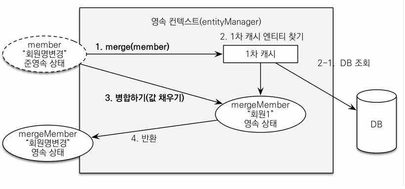

## Ch 8. 웹 계층 개발

### 변경 감지와 병합 (merge)

#### 준영속 엔티티란
:영속성 컨텍스트가 더는 관리하지 않는 엔티티

#### 준영속 엔티티를 수정하는 방법 2가지
* 변경 감지 기능 사용
* 병합(merge) 사용

#### 변경 감지 기능 사용

    @Transactional
    void update(Item itemParam) { //itemParam: 파리미터로 넘어온 준영속 상태의 엔티티
        Item findItem = em.find(Item.class, itemParam.getId()); //같은 엔티티를 조회한다.
        findItem.setPrice(itemParam.getPrice()); //데이터를 수정한다.
    }

영속성 컨텍스트에서 엔티티를 다시 조회한 후에 데이터를 수정하는 방법

트랜잭션 안에서 엔티티를 다시 조회하고, 변경할 값을 선택한다.
트랜잭션 커밋 시점에 변경 감지(Dirty Checking)가 동작하여 DB에 UPDATE SQL 실행됨.

#### 병합 사용
병합은 준영속 상태의 엔티티를 영속 상태로 변경할 때 사용하는 기능

    @Transactional
    void update(Item itemParam) { //itemParam: 파리미터로 넘어온 준영속 상태의 엔티티
        Item mergeItem = em.merge(itemParam);
    }

#### 병합 동작 방식
1. merge()를 실행
2. 파라미터로 넘어온 준영속 엔티티의 식별자 값을 1차 캐시에서 엔티티 조회(1차 캐시에 엔티티 없으면, DB에서 엔티티 조회하고, 1차 캐시에 저장)
3. 조회한 영속 엔티티(mergeMember)에 member 엔티티의 값을 채워 넣음. ("회원1" -> "회원명변경")
4. 영속 상태인 mergeMember 반환

*주의: 변경 감지 기능을 사용하면 원하는 속성만 선택해서 변경할 수 있지만, 병합 사용시 모든 속성이 변경된다. 병합시에 값이 없으면 null로 업데이트 할 위험도 있다. (병합은 모든 필드를 교체한다.)
따라서, 실무에서는 주로 변경가능한 데이터만 노출하기 때문에, 병합을 사용하는 것이 더 번거로울 수 있다.`*

