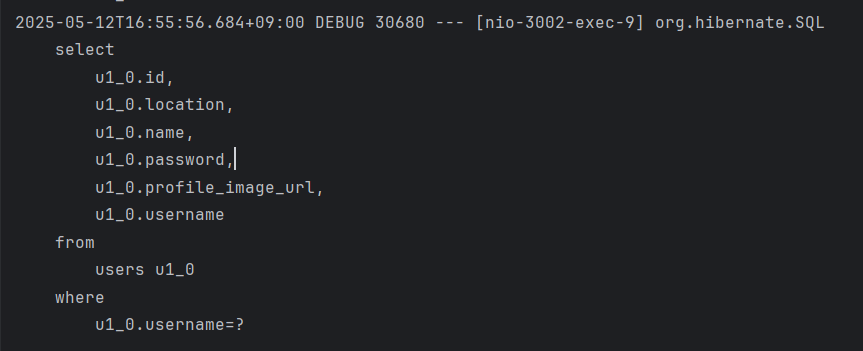
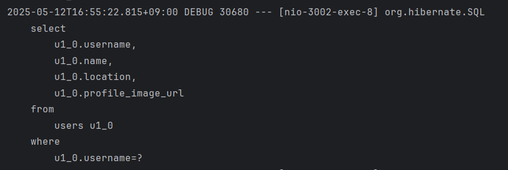

# DTO 직접 조회 전략으로 마이페이지 API 최적화하기

---

## 1. 🔍 발표 배경

본 강의 수강 후 기반으로 개발한, Silkroad 프로젝트에서 마이페이지(사용자 정보 조회)는 핵심 기능 중 하나이다. 개발 과정에서 초기에는 엔티티 전체를 불러온 후 DTO로 변환하는 방식이었지만, 이 방식은 불필요한 필드까지 모두 조회하게 되어 성능과 유지보수 측면에서 비효율적일 수 있다는 생각이 들었다.

따라서, 이번 발표에서는 **DTO 직접 조회 전략**을 적용해 **조회 성능을 최적화**하고, 그 전후 비교를 통해 성능 차이를 확인한 사례를 소개하고자 한다.

---

## 2. ⚙️ 기존 방식 (Before)

```java
// UserService.java
public UserInfoResponse getMyInfo(String username){
    User user = userRepository.findByUsername(username)
        .orElseThrow(() -> new IllegalArgumentException("해당 사용자가 없습니다."));

    return new UserInfoResponse(user.getUsername(), user.getName(), user.getLocation(), user.getProfileImageUrl());
}
```

```java
// UserRepository.java
Optional<User> findByUsername(String username);
```

* **쿼리**: `SELECT * FROM users WHERE username = ?`
* **문제점**:

    * `id`, `password` 등 필요 없는 필드까지 모두 SELECT
    * 사용자 테이블이 확장될수록 낭비 증가

---

## 3. 개선 방식 (After: DTO 직접 조회)

### DTO 정의

```java
@Getter
@AllArgsConstructor
public class UserInfoOptimizedResponse {
    private String username;
    private String name;
    private String location;
    private String profileImageUrl;
}
```

### Repository 쿼리 변경

```java
@Query("select new com.silkroad.silkroad.dto.UserInfoOptimizedResponse(u.username, u.name, u.location, u.profileImageUrl) " +
       "from User u where u.username = :username")
Optional<UserInfoOptimizedResponse> findUserInfoOptimizedByUsername(@Param("username") String username);
```

### Controller 테스트용 엔드포인트

```java
@GetMapping("/me-dto")
public UserInfoOptimizedResponse getMyInfoOptimized(@AuthenticationPrincipal UserDetails userDetails) {
    StopWatch sw = new StopWatch();
    sw.start();
    UserInfoOptimizedResponse response = userService.getMyInfoOptimized(userDetails.getUsername());
    sw.stop();
    System.out.println("⏱️ 실행 시간 (After): " + sw.getTotalTimeMillis() + "ms");
    return response;
}
```

---

## 4. 실행 결과 비교

### 응답 시간 (단위: ms)

| 방식     | 호출별 응답 시간         | 평균  |
| ------ | ----------------- | --- |
| Before | 5 / 3 / 4 / 2 / 3 | 3.4 |
| After  | 2 / 2 / 1 / 1 / 1 | 1.4 |

> 📉 응답 시간이 약 **60% 감소**

### 쿼리 로그 비교
- Before



- After


| 항목        | Before                  | After                   |
| --------- | ----------------------- | ----------------------- |
| SELECT 필드 | id, password 포함 전체      | username, name 등 일부 필드만 |
| 쿼리 수      | 3회 (SecurityContext 포함) | 3회 (1회만 DTO 방식)         |

---

## 5. 결론 및 이점

| 항목        | Before 방식   | After 방식 (DTO 직접 조회) |
| --------- | ----------- | -------------------- |
| 유지보수성     | 낮음 (엔티티 의존) | 높음 (DTO 독립적)         |
| 응답 성능     | 필드 많아질수록 느림 | 필드 수 최소화로 빠름         |
| 조회 대상     | 전체 엔티티      | 필요한 필드만              |
| API 응답 구조 | 별도 수동 매핑 필요 | 쿼리 단계에서 DTO 생성       |

---

## 6. 📚 참고 자료

* 김영한, "스프링 부트와 JPA 활용 2편"
* Postman API 성능 테스트
* Hibernate SQL 로그 분석 (`org.hibernate.SQL`, `BasicBinder`)


